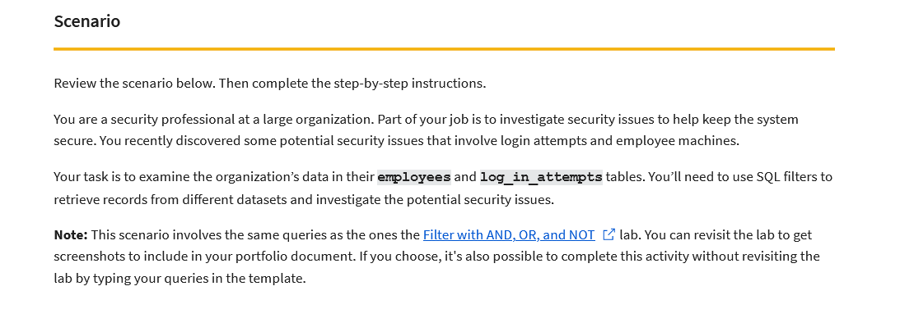

# Google-Cert-SQL-queries
A project made in Google Cybersecurity Certificate.

A portfolio activity in Google Cybersecurity Certificate to prove my skills gain in SQL.

I was given a following scenario:

I had to use SQL filtering to find some data I needed. Everything is descripted in "Apply filters to SQL queries.pdf" file.
